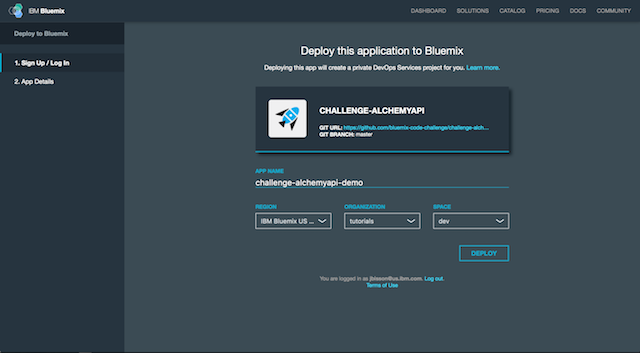
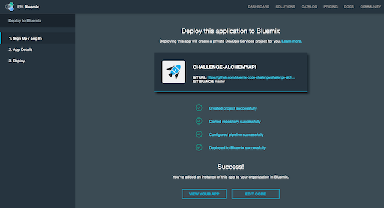
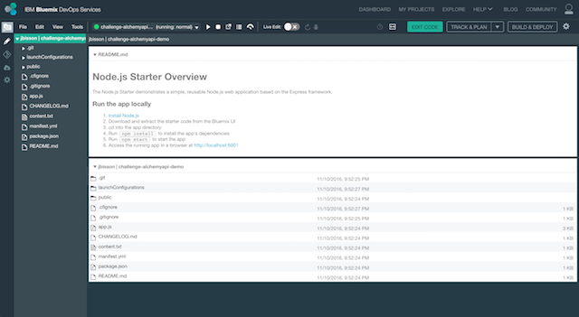
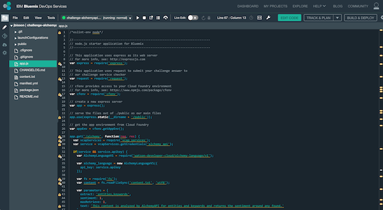
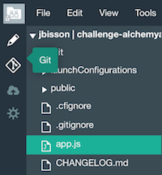
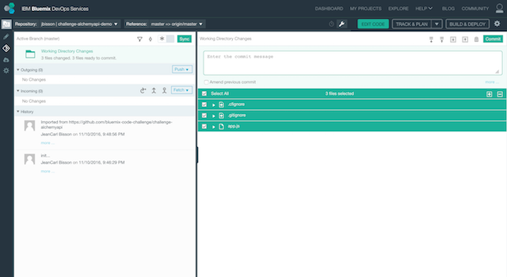
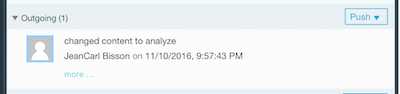
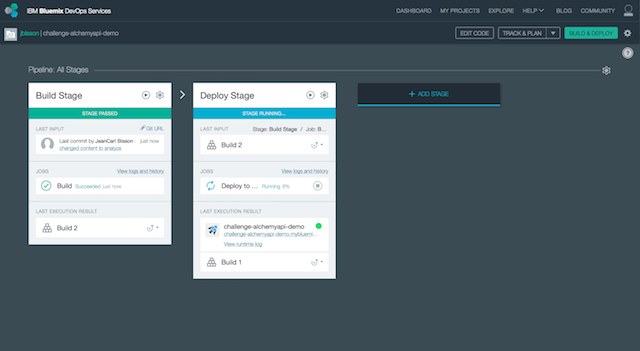
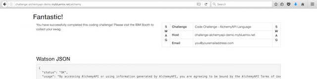

# Code Challenge: AlchemyLanguage API

This challenge shows you how to deploy a Bluemix application, use IBM Bluemix DevOps Services, and use the IBM Watson AlchemyLanguage API service in Node.js.

## Running the app on Bluemix

1. Deploy the challenge application

 [](https://bluemix.net/deploy?repository=https://github.com/bluemix-code-challenge/challenge-alchemyapi.git)

2. Enter an application name. The host you choose will determinate the subdomain of your application's URL: `<host>.mybluemix.net`.

  [](./img/deploy.png)

3. Wait for the deployment to complete. Click on Edit Code.

  [](./img/deploymentsummary.png)

4. The IBM Bluemix DevOps Services tools allow you to edit code in the browser, configure a pipeline of processes to execute when new code is committed, and deploy applications automatically to IBM Bluemix.

  Select `app.js` to edit the application source code.

  [](./img/devops.png)

5. In this challenge, we’ll analyze content for entities and keywords.

  [](./img/editor.png)

6. Replace the text `This content is analyzed by AlchemyAPI for entities and keywords and returns the sentiment around any found.` on line 46 with the variable `content` as shown below.

  ```
  ...
  maxRetrieve: 1,
    text: 'This content is analyzed by AlchemyAPI for entities and keywords and returns the sentiment around any found.'
  };
  ...
  ```

  The change should look as shown below.

  ```
  ...
  maxRetrieve: 1,
    text: content
  };
  ...
  ```

7. Replace the value for the `email` property on line 57 with your email address.
  ```
  ...
    // Change only the email address.
    var submission = {
      email: 'you@youremailaddress.com',
      data: JSON.stringify(result),
  ...
  ```

8. Lastly, uncomment lines 70 – 72 so the application can be verified.

  ```
  ...  
  // Uncomment
  //request.post('https://code-checker.mybluemix.net/check/challengealchemyapi', {form: submission}, function(err, response, body) {
  //  res.send(body);
  //});
  ...
  ```

  The change should look as shown below.

  ```
  ...  
  // Uncomment
  request.post('https://code-checker.mybluemix.net/check/challengealchemyapi', {form: submission}, function(err, response, body) {
    res.send(body);
  });
  ...
  ```

9. Now that changes have been made, the following steps will commit the changes to the attached Git repo. Click on the Git icon on the left side.

  [](./img/giticon.png)

10. Enter a commit message. Click on Commit.

  [](./img/commit.png)

11. In the left column, click on Push in the Outgoing section. This will push the changes to the remote branch.

  [](./img/push.png)

12. You can see the progress of the application deployment by clicking on the Build & Deploy button in the top-right corner of the page.

  [](./img/pipeline.png)

13. When the application has finished deploying to your IBM Bluemix account, visit your application’s URL, appended with `/alchemy`.

  [](./img/result.png)

  If you see a Fantastic page, you've completed this challenge successfully. If the page doesn't return a message, or it says Uh Oh!, please check the previous steps.
